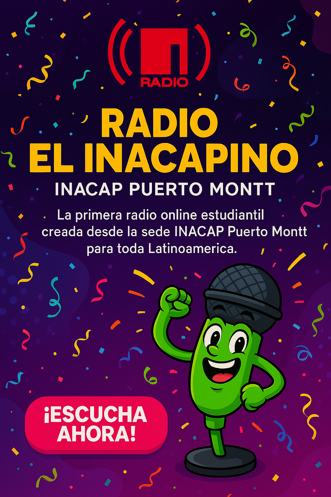

  

  
  
  
  

---
# Radio El Inacapino - INACAP Puerto Montt

**Bienvenidos a la primera Radio Online Estudiantil creada desde la sede INACAP Puerto Montt para toda Latinoamérica.**

Este proyecto nace con el objetivo de conectar, informar, entretener y motivar a la comunidad estudiantil a través de una plataforma moderna, interactiva y hecha 100% por estudiantes.

---

## ✨ Características principales

- 🎥 **Programas en vivo** transmitidos por Twitch con contenido estudiantil y musical.
- 🎵 **AutoDJ** que reproduce videoclips y contenidos educativos de manera continua.
- 🌐 **Señal alternativa** desde Zeno.FM para escuchar solo audio.
- 📰 **Noticias destacadas** de la sede y actualidad nacional.
- 🎡 **Cápsulas educativas** y motivacionales producidas por alumnos.
- 🌟 **Concursos, encuestas y espacios de participación** estudiantil.
- 🎨 **Muro de los Buenos Deseos**, donde los estudiantes comparten mensajes positivos.

---

## ⚙️ Tecnologías utilizadas

- **HTML5, CSS3, JavaScript (Vanilla)**
- **Firebase Realtime Database y Storage**
- **Zeno Radio Streaming y Twitch Embeds**
- **Google Apps Script y Google Sheets** (para interacciones del chat y deseos)
- **Hosting mediante GitHub Pages**

---

## 🚀 Objetivos del Proyecto

- Fortalecer la identidad de la comunidad estudiantil.
- Crear un canal de comunicación moderno, inclusivo y entretenido.
- Dar visibilidad a los talentos y actividades de la sede.
- Motivar a estudiantes con contenido positivo y formativo.
- Replicar este modelo en las **29 sedes de INACAP a nivel nacional**.

---

## 🔗 Enlace de acceso

[**https://sonrisitaeventos.github.io/inacapino**](https://sonrisitaeventos.github.io/inacapino)

---

## 🤝 Colabora con nosotros

Este proyecto está abierto a recibir ideas, colaboraciones, mejoras técnicas, nuevos locutores, productores de contenido y auspiciadores estudiantiles.

Si eres parte de otra sede INACAP y quieres implementarlo en tu región, ¡contáctanos!

---

## 👨‍🏫 Autor y coordinador general

**Cristián Riffo Araya**  
Coordinador de Actividades Temporales - INACAP Puerto Montt  
Ingeniero en Electricidad, Educador y Emprendedor Tecnológico  
---

> "La educación es el pasaporte al futuro, y la voz del estudiante merece ser escuchada."

